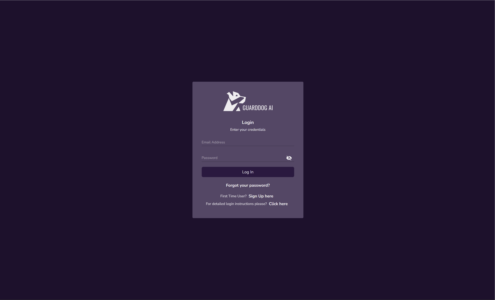
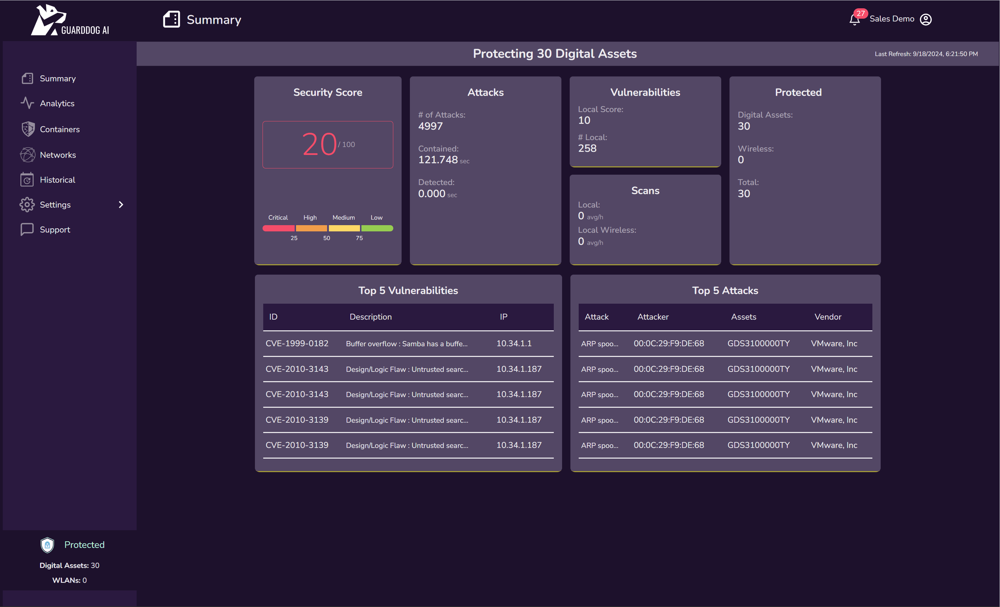
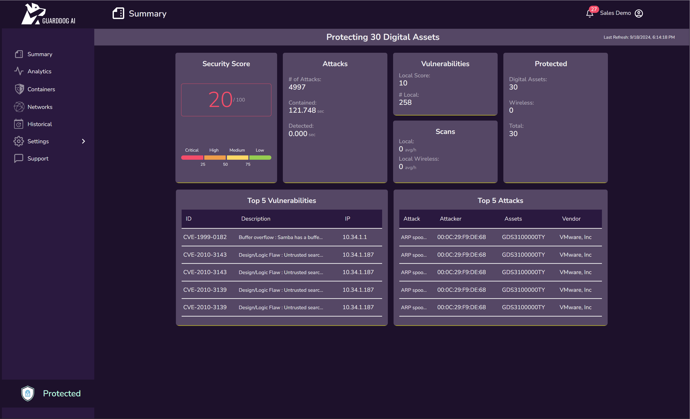
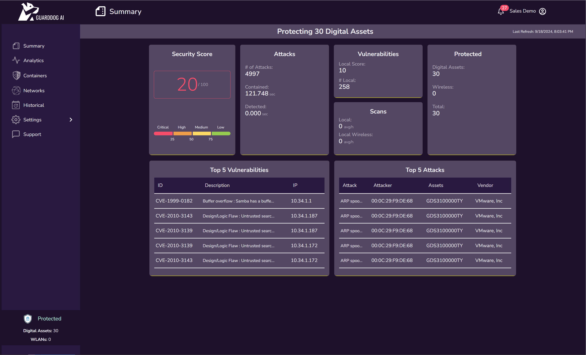
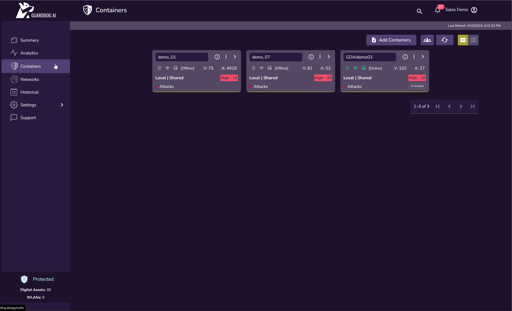

# GUARDDOG AI DCX Dashboard User Manual
Version 1  

---

## Table of Contents
1. [Revision History](#revision-history)
2. [Terminology](#terminology)
3. [Login Page](#login-page)
4. [Summary Page](#summary-page)
5. [Analytics](#analytics)
6. [Containers](#containers)
7. [Networks](#networks)
8. [Historical](#historical)
9. [Settings](#settings)
10. [Support](#support)
11. [How Do I...](#how-do-i)
12. [Steps](#steps)

---

## Revision History
- Released: October 2022
- Updated: October 2023

---

## Terminology

- **MAC Address**: Media access control address uniquely identifies network devices.
- **IP Address**: A unique string identifying devices using Internet Protocol.
- **Notifications**: System alerts for attacks, vulnerabilities, or events.
- **Containers**: Devices (physical or virtual) connected to the network.
- **Attacks**: Incidents that compromise the network.
- **Vulnerabilities**: Vulnerabilities on network devices posing risks.
- **Card**: UI representation of information.
- **CVE**: Common Vulnerability and Exposure.
- **NIST**: Authority in vulnerability classification.
- **Networks**: Local and remote network assets.
  - **Local Networks**: Network where the container is deployed and full visibility wanted (e.g., corporate, campus networks).
  - **Remote Networks**: External or private network where the container is deployed by confidentiality and privacy are required (e.g., home office).
- **Shared Mode**: Mode determining data visibility to the customer.
- **Wireless Networks**: Non-wired networks detected by containers.
  - **Identified**: Networks with broadcasted SSIDs.
  - **Unidentified**: Networks without visible SSIDs.
- **Refresh rate**: Non-wired networks detected by containers.
- **GDS ID**: Identification name for all containers deployed.
- **Serial Number**: Number automatically generated by the system when the container is registered.
- **License Key**: Key generated in the system and provided to the customer to deploy the containers.
- **Classification of attacks**: The classification is based on the nature of the attack.
- **Detection**: Events triggered when the container identifies an attack.
- **Containment**: Countermeasures deployed to isolate and contain the attack.
- **Scans**: Scans performed on the network.
  - **Wired**: Physical network.
  - **Wireless**: Non-wired network.

---

## Login Page

To log in to the DCX Dashboard:
1. Go to [https://dcx.guarddog.ai](https://dcx.guarddog.ai)
2. Enter your credentials or create an account.

Minimum password requirements:

- 1 special character (choose between these !@#$&*)
- 2 digits
- 2 caplital letters
- 3 lowercase letters
- Minimum length of 8 characters

If it is the first time you are accessing this portal, then you would need to create an account. Click on Sign Up to create the account and then just follow the steps on the screen.

---

## Summary Page

This is the landing page where a summary of the events and status of containers and assets are displayed:

## Main Menu

The main menu is located on the left side of the screen. The menu items shown may differ based on the license and modules activated.

---

## Analytics

This page shows a more advanced view of what you saw in Summary. It hows the overall information for the entire system including data from all containers registered in the system. Depending on the size and resolution of the screen it may fully show the menu on the left hand side of the screen or show a reduced menu, known as the “hamburger menu icon”. You can display the menu by clicking on it.

### The Containers card 

The first card we show in the Analytics page is the Containers card. 
1.	This shows the total number of containers registered in the system
2.	The number of containers that are offline and online. This refers to the containers that are communicating or not with the main system in the Cloud. Once we do not see the container connected then we will show that container as offline.
3.	We also show our proprietary simple security score. The Security Score is a graphical representation of the risk and vulnerability of your network and the assets in it. Today the simple score is based on the containers you have, the vulnerabilities found and then severity level of those vulnerabilities.
4.	There is also the notion of Local and Remote network/containers. Please refer to the Terminology section for more information on this categorization. 
5.	The tip of the arrow takes you to the Units page when clicked on. See the Units section for more information.

### The attacks card

This shows if there have been any attacks so far on your network within the time interval chosen for the module, please refer to the Settings section for more information on this.
1.	Total number of attacks
2.	The amount of time it took to detect all the attacks
3.	The amount of time that it took to contain the attacks
4.	Click on the arrow to open the attacks page

## The attacks page

This page shows all the attacks detected by al units in the system. Here is a sample of it.

### The attack card

Below we show cards for detection and for mitigation both expanded and collapsed, for more information on this please see Terminology. The card has several elements:
1.	Name of the attack detected.
2.	MAC address of the attacker.
3.	Date of the attack.
4.	Time the action started.
5.	Percentage of attacks based on overall total.
6.	Manufacturer of the attacking device.
7.	Information/description icon.
8.	Arrow to expand/collapse the card.
9.	Unit that performed the action.
10.	Total time that took for the action to be performed.
11.	Time at which the action performed finished.

## The Vulnerabilities card

This shows the overall threats information in the system both in local and remote units. Please refer to the Terminology section for more information.
1.	Arrow to open the threats page.
2.	Local score. The severity level of all local units
3.	Remote score. The severity vulnerability level of all remote units.
4.	Number of local threats. Total number of threats found by local units.
5.	Number of remote threats. Total number of threats found by remote units.

## The Vulnerabilities page

The page shows all the threats found by all units in the system.

### The Vulnerabilities card 

This card shows the information about a specific threat found on a device connected to the network. The following items are part of the card:
1.	CVE of the vulnerability.
2.	Device where the vulnerability was found.
3.	Software affected.
4.	Brief description of the vulnerability.
5.	Open port related to it.
6.	Information/description icon.
7.	Arrow to go to NIST article about the vulnerability.
8.	Score of vulnerability.
9.	Version impacted.
10.	Date discovered.

### The networks card. 

This shows information from the different networks detected by all units, local and remote, registered in the system. Depending on the configuration of the network this will show all devices connected to the network whether they are wired or wireless. Wireless in this card refers to wireless networks found by all the units. For a definition on how local and remote units are classified please refer to the Terminology section.
1.	Arrow to open the networks page. The networks page. This takes to same page the Network menu item does. You can get more details by going to the Networks menu option.
2.	Local. These shown here are all network devices found by local units.
3.	Remote. These represent the total number of connected devices found by remote units.
4.	Local wireless. These are the wireless networks, and surrounding wireless devices transmitting, found by local units.
5.	Remote wireless. These are the wireless networks, and surrounding wireless devices transmitting, found by remote units.

### The scans card

The system is constantly scanning multiple times an hour in both the wire and wireless connections. This is represented by the average number of scans performed in 1 hour based on the last 24 hours. The way to ready this in our example would be that the local units scanned the wired network an average of 87 times per hour, and for the wireless would be that the units scanned the wireless area around them an average of 63 times per hour.
1.	Local wired scans.
2.	Remote wired scans.
3.	Local wireless scans.
4.	Remote wireless scans. 

### The global map

The system is designed with growth and being capable of managing multiple devices throughout the world. In the map we show a shield icon on those locations where a fido unit has been deployed. By clicking on the shield we will show the device GDS id and its location.

### Avatar Icon

Clicking on the avatar shows options to:
1. View Profile
   1. Here you have the option to change the name on the account and the company.
   2. We recommend that you fill this out completely.
2. Change Password
   1. Choose this option to change the password on the account
3. Sign out

### Notifications Icon
Click the bell icon to view:
- Latest notifications

---

## Containers

### Add Containers
Container registration:
1. Containers are registered automatically when they are deployed.
2. By clicking on this button you have the option to manually add it for troubleshooting purposes and if indicated by Support.
3. Option to bulk upload contianers using a provided template.

### Card and Table icons

The Card view and Table view buttons allow you to change how the information on the screen is shown. By default the information in the system is shown in 

### Containers Card
The container card shows:
1. Status of the unit (online/offline)
2. Security score based on vulnerabilities
3. Local/Remote unit classification

### Container Details Page
This page contains:
- Serial number, GDS ID, status, and privacy mode of the unit.
- Threats and attacks detected by the unit.
- Network information (local and remote).

There are multiple items on this page, let’s go through all of them:

1.	Friendly name of the unit. This is the name you chose for the unit when registering it.
2.	Serial number. This is the serial number that was used to register the unit.
3.	GDS ID. This is an identification name provided by the system. This cannot be modified.
4.	Privacy mode.
    Shared.
b.	Not shared.
5.	Threat score.
6.	Shared mode.
7.	Status icons. From left to right:
a.	Services up (green) or down (red).
b.	Wireless on.
c.	Ethernet on.
8.	Threat score. Highest level of severity of vulnerabilities found.
9.	Last updated. Last time the data was received and refreshed from the unit.
10.	IP addresses.
a.	Private. 
b.	Public. 
11.	Unit attacks card.
a.	Arrow opens attacks page.
b.	Total number of attacks.
c.	The amount of time it took to mitigate all the attacks.
d.	The amount of time that took to detect the attacks.
12.	Unit threats card. Based on this unit:
a.	Arrow opens threats page.
b.	Local score. The severity level of all local units.
c.	Remote score. The severity vulnerability level of all remote units.
d.	Number of local threats. Total number of threats found by local units.
e.	Number of remote threats. Total number of threats found by remote units.
13.	Unit networks card. Based on this specific unit:
a.	Arrow opens networks page.
b.	Local. These shown here are all network devices found by local units.
c.	Remote. These represent the total number of connected devices found by remote units.
d.	Local wireless. These are the wireless networks, and surrounding wireless devices transmitting, found by local units.
e.	Remote wireless. These are the wireless networks, and surrounding wireless devices transmitting, found by remote units.

### The unit card

This is the main card for the unit we have deployed and registered in the system. There are multiple places to look at here:

1. Friendly name for the unit. This is the name you chose for the unit when registering it.
2. Status icons. From left to right:
   1. Services up (green) or down (red)
   2. Wireless on
   3. Ethernet on
3. Unit type and Shared mode.
   1. Type (see terminology)
      1. LocalRemoteShared mode (see Terminology)
      2. SharedNot shared
4. Alert of attacks. This will be displayed when attacks are detected.
5. Information/description icon. By clicking on it you will see a brief description of the card items.
6. Action menu. See the image below for items:
   1. Edit the unit’s friendly name
   2. Mark the unit as Local or Remote. This depends on the current mode, so it is dynamic.
   3. Mark as not shared
   4. Remove the unit from the system
7. Open unit. This will display a details page. See Unit Details section.
8. Threat count. Total number of threats found by the unit.
9. Attack count. Total number of attacks detected by the unit.
10. Threat score. Highest level of severity of vulnerabilities found.
11. Last updated. Last time the data was received and refreshed from the unit.

## Unit attacks page

And that takes us to this unit attacks page.

Below we show cards expanded and collapsed for an attack. For more information on attack classification please see Terminology. The card has several elements:
1. Name of the attack detected.
2. MAC address of the attacker.
3. Date of the attack.
4. Time the attack started.
5. Percentage of attacks based on overall total.
6. Information/description icon.
7. Arrow to expand/collapse the card.
8. Unit that performed the action.
9. Total time that took for the action to be performed.
10. Time at which the action performed finished.

Up top you can select the filter to show attacks by either attack or attacker.

The unit threats card. Going from this card, click on the arrow.
Items shown:
1. Arrow to open the threats page.
2. Local score. The severity level of all local units
3. Remote score. The severity vulnerability level of all remote units.
4. Number of local threats. Total number of threats found by local units.
5. Number of remote threats. Total number of threats found by remote units.

## The threats card

This card shows the information about a specific threat found on a device connected to the network. The following items are part of the card:

1. CVE of the vulnerability.
2. Device where the vulnerability was found.
3. Software affected.
4. Brief description of the vulnerability.
5. Open port related to it.
6. Information/description icon.
7. Arrow to go to NIST article about the vulnerability.
8. Score of vulnerability.
9. Version impacted.
10. Date discovered

## The unit networks card

From this card we click on the arrow to show the networks page of the unit.
The data we find on this card is as follows:
1. Arrow to open the networks page.
2. Local. These shown here are all network devices found by local units.
3. Remote. These represent the total number of connected devices found by remote units.
4. Local wireless. These are the wireless networks, and surrounding wireless devices transmitting, found by local units.
5. Remote wireless. These are the wireless networks, and surrounding wireless devices transmitting, found by remote units.

## The unit networks page

Very much like the global networks page, this shows all information related to the networks found by unit you clicked on. Here we show 3 consolidated cards. For a definition of these please see Terminology.
1. Local Networks.
2. Remote Networks.
3. Wireless Networks.

## The local networks card

Here we have the following items:
1. IP ranges. These are the IP ranges found on the network.
2. Devices. These are the connected devices, both wired and wireless, discovered on the network.
3. Protected devices. These are the total number of protected devices.
4. Severity level. The highest vulnerability severity level found.
5. Threats count. Total number of vulnerabilities found.
6. Protected status. Whether the entire network with all of its devices are protected or not.
7. Units. Fido units found on the network.
8. Wireless. These are the wireless networks (access points or transmitting devices) found around the unit.
9. Ports opened. These show the total number of ports found that are open and those with vulnerabilities related to them. You would read these as 90 total ports open, 84 without vulnerabilities, 6 with vulnerabilities. The last count should show the color of the highest threat found.
10. High threats count. Out of all vulnerabilities found (19), 5 are high.
11. Last updated. Last time we updated this card with the data from the unit.

The unit local networks details page.  The information shown across the top of the screen is the same as the one shown on the card we previously went over. Beneath that details section you will see the IP ranges found on the network.

The local networks IP range card. The card shows information we are already familiar with, such as 
1. IP range
2. Number of devices
3. Number of threats
4. Ports open and with vulnerabilities
5. Arrow to open the IP range
6. Last updated.

The unit local networks devices page from the selected IP range. By clicking on the arrow on the IP range card we get to this page.

## The connected device card

Items for this card:
1. IP of the connected device. To protect this device, click on it. Green means protected.
2. MAC address of the device.
3. Unit that discovered the device.
4. Manufacturer of the device discovered.
5. Port information.
6. Information/description of the card.
7. Actions menu to display options.
8. Arrow to open the device details page.
9. Number of threats.
10. Hostname of the device.
11. Last updated.

---

## Networks

### Global Networks Page
This shows:
1. Local Networks: Devices within the internal network.
2. Remote Networks: Devices on external/private networks.
3. Wireless Networks: Surrounding wireless networks detected.

---

## Historical

### Global Historical Page
This page presents historical data on:
1. Threats and attacks.
2. Scans.
3. Network activities.
4. Wireless networks.

---

## Settings

In the settings page, you can:
- Configure preferences such as email reports.
- Set time intervals for data display in the portal.
- Customize notification settings.

---

## Support

To contact support:
1. Open a support ticket via the Support page.
2. Fill in the form with detailed incident information.

---

## How Do I...
1. **Create an account?**  
   - Go to [https://fido.guarddog.ai](https://fido.guarddog.ai) and sign up.
2. **Choose a secure password?**  
   - Use at least 20 characters.
3. **Register my Fido unit?**  
   - Go to Units > Add Units and input the serial number and PIN.
4. **Protect a wireless network?**  
   - Go to Networks > Wireless Networks > Identified Networks and select a network to protect.
5. **Change the time interval for data display?**  
   - Go to Settings > Modules and choose a desired interval.

---

## Steps

1. Obtain a Fido unit.
2. Create an account at [https://fido.guarddog.ai](https://fido.guarddog.ai).
3. Log in and ensure internet access.
4. Plug the unit into a port that has access to the internet.
5. Register the unit using the serial number and PIN.
6. Once operational, the unit will display 3 green status icons.
7. Protect your wireless network by going to Networks > Wireless Networks.
8. Ensure your profile is filled out.
9. Enjoy using your Fido unit!

