# GUARDDOG AI DCX Dashboard User Manual
Version 1  

---

## Table of Contents
1. [Revision History](#revision-history)
2. [Terminology](#terminology)
3. [Login Page](#login-page)
4. [Summary Page](#summary-page)
5. [Analytics](#analytics)
6. [Containers](#containers)
7. [Networks](#networks)
8. [Historical](#historical)
9. [Settings](#settings)
10. [Support](#support)
11. [Isolation](#isolation) TBD
12. [Grouping](#grouping) TBD
13. [How Do I...](#how-do-i)
14. [Steps](#steps)

---

## Revision History

- Updated: September 2024
- Updated: October 2023
- Released: October 2022

---

## Terminology

- **Security Score**: The Security Score is a graphical representation of the risk and vulnerability of your network and the assets in it. Today the simple score is based on the containers you have, the vulnerabilities found and then severity level of those vulnerabilities.
- **MAC Address**: Media access control address uniquely identifies network devices.
- **IP Address**: A unique string identifying devices using Internet Protocol.
- **Notifications**: System alerts for attacks, vulnerabilities, or events.
- **Containers**: Devices (physical or virtual) connected to the network.
- **Attacks**: Incidents that compromise the network.
- **Vulnerabilities**: Vulnerabilities on network devices posing risks.
- **Card**: UI representation of information.
- **CVE**: Common Vulnerability and Exposure.
- **NIST**: Authority in vulnerability classification.
- **Networks**: Local and remote network assets.
  - **Local Networks**: Network where the container is deployed and full visibility wanted (e.g., corporate, campus networks).
  - **Remote Networks**: External or private network where the container is deployed by confidentiality and privacy are required (e.g., home office).
- **Shared Mode**: Mode determining data visibility to the customer.
- **Wireless Networks**: Non-wired networks detected by containers.
  - **Identified**: Networks with broadcasted SSIDs.
  - **Unidentified**: Networks without visible SSIDs.
- **Refresh rate**: Non-wired networks detected by containers.
- **GDS ID**: Identification name for all containers deployed.
- **Serial Number**: Number automatically generated by the system when the container is registered.
- **License Key**: Key generated in the system and provided to the customer to deploy the containers.
- **Classification of attacks**: The classification is based on the nature of the attack.
- **Detection**: Events triggered when the container identifies an attack.
- **Containment**: Countermeasures deployed to isolate and contain the attack.
- **Scans**: Scans performed on the network.
  - **Wired**: Physical network.
  - **Wireless**: Non-wired network.

---

## Login Page

To log in to the DCX Dashboard:
1. Go to [https://dcx.guarddog.ai](https://dcx.guarddog.ai)
2. Enter your credentials or create an account.

If it is the first time you are accessing this portal, then you would need to create an account. Click on Sign Up to create the account and then just follow the steps on the screen.

---

## Sign Up Page

Fill out the form to create an account in the system:
1. Enter your email address
2. Enter the password following the minimum requirements below.
3. Confirm the password
4. You can click on the eye icon to reveal the password to double check it.
5. Read and check the boxes for Terms of Service, Privacy policy, and End-User License Agreement.
6. Click on the Sign up now button to submit it.

Minimum password requirements:

- 1 special character (choose between these !@#$&*)
- 2 digits
- 2 caplital letters
- 3 lowercase letters
- Minimum length of 8 characters

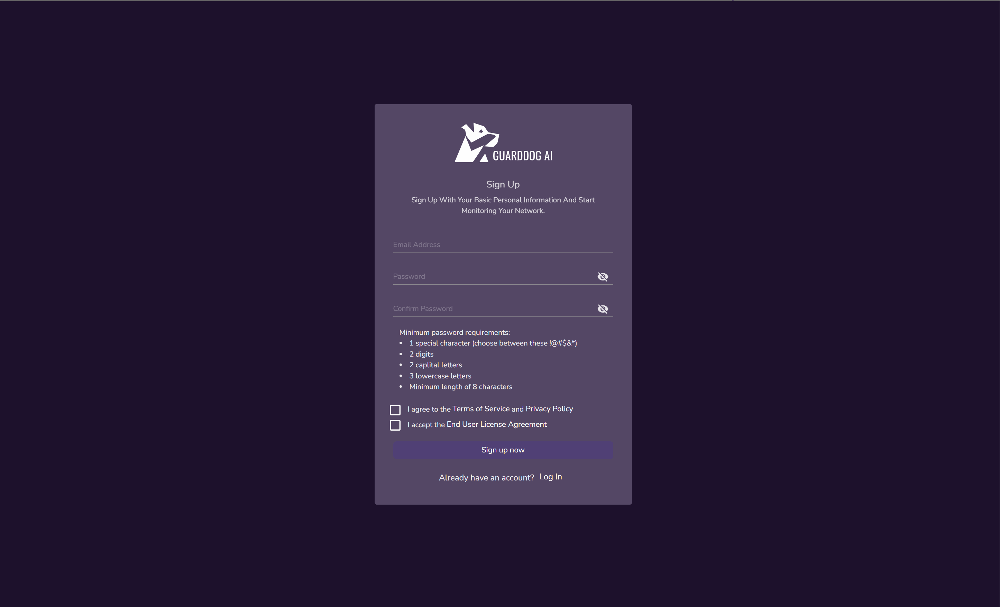

---

## Summary Page

This is the landing page where a summary of the events and status of containers and assets are displayed:
1. Security Score:
	1. Score
	2. Legend. From Critical to Low.
2. Attacks card:
	1. Total number of attacks.
	2. Contained. Average time to contain detected attacks.
	3. Detected. Average time to detect all attacks.
3. Vulnerabilities card:
	1. Local score.
	2. Number of local vulnerabilities.
5. Scans card:
	1. Local.
	2. Local wireless.
4. Protected card:
	1. Total number of digital assets protected.
	2. Wireless assets protected.
	3. Total number of digital assets.
5. Top 5 Vulnerabilities card:
	1. It shows the top vulnerabilities by severity
6. Top 5 attacks card:
	1. It shows the most recent attacks

## Main Menu

The main menu is located on the left side of the screen. The menu items shown may differ based on the license and modules activated.

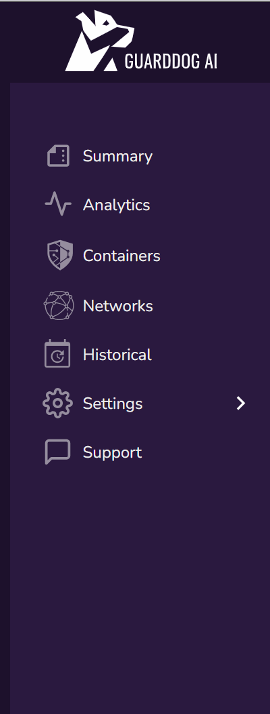

---

## Analytics

This page shows a more advanced view of what you saw in Summary. It hows the overall information for the entire system including data from all containers registered in the system. Depending on the size and resolution of the screen it may fully show the menu on the left hand side of the screen or show a reduced menu, known as the “hamburger menu icon”. You can display the menu by clicking on it.

1. Containers card:
	1. Total Containers.
	2. Online/offline.
	3. Security score.
	4. Local/Remote containers.
2. Attacks card:
	1. Total number of attacks.
	2. Contained. Average time to contain detected attacks.
	3. Detected. Average time to detect all attacks.
3. Vulnerabilities card:
	1. Local score.
	2. Remote score.
	3. Number of local vulnerabilities.
	4. Number of remote vulnerabilities.
4. Networks:
	1. Local.
	2. Remote.
	3. Local wireless.
	4. Remote wireless.
5. Scans card:
	1. Local.
	2. Remote.
	3. Local wireless.
	4. Remote wireless.
6. Real-time Global Map.

### The Containers card 

The first card we show is the Containers card. An arrow shows when there are containers to let you go to the Containers page.
1. This shows the total number of containers registered in the system
2. The number of containers that are offline and online. This refers to the containers that are communicating or not with the main system in the Cloud. Once we do not see the container connected then we will show that container as offline.
3. We also show our proprietary simple security score. The Security Score is a graphical representation of the risk and vulnerability of your network and the assets in it. Today the simple score is based on the containers you have, the vulnerabilities found and then severity level of those vulnerabilities.
4. There is also the notion of Local and Remote network/containers. Please refer to the Terminology section for more information on this categorization. 

### The Attacks card

This shows if there have been any attacks so far on your network within the time interval chosen for the module, please refer to the Settings section for more information on this.
1. Total number of attacks
2. The amount of time it took to contain all the attacks
3. The amount of time that it took to detect the attacks
4. Click on the arrow to open the attacks page

## The Attacks page

This page shows all the attacks detected by all containers in the system. Here is a sample of it.
1. The "Show By" button allows you to sort the content on the screen by attack or attacker.
2. Attack card:
	1. Name of the attack detected.
	2. MAC address of the attacker.
	3. Date of the attack.Name
	4. Manufacturer of the attacking device.
	5. Information icon
	6. Container which detected the attack
	7. Time it took to perform the action
	8. Arrow pointing down shows:
		1. Time at which the action started
		2. Time at which the action stopped
		3. Percentage of that type of attacks compared to all other attacks shown.

## The Vulnerabilities card

This shows the overall vulnerabilities information on the network where the containers are deployed. Please refer to the Terminology section for more information.
1. Arrow to open the threats page.
2. Local score. The severity level of all local containers
3. Remote score. The severity vulnerability level of all remote containers.
4. Number of local threats. Total number of threats found by local containers.
5. Number of remote threats. Total number of threats found by remote containers.

## The Vulnerabilities page

The page shows all the threats found by all containers in the system.

### The Vulnerabilities card 

This card shows the information about a specific threat found on a device connected to the network. The following items are part of the card:
1. CVE of the vulnerability.
2. Device where the vulnerability was found.
3. Open port related to it.
4. Software affected.
5. Brief description of the vulnerability.
6. Information/description icon.
7. Arrow to go to NIST article about the vulnerability.
8. Score of vulnerability.
9. Version impacted.
10. Date discovered.

### The networks card. 

This shows information from the different networks detected by all containers, local and remote, registered in the system. Depending on the configuration of the network this will show all devices connected to the network whether they are wired or wireless. Wireless in this card refers to wireless networks found by all the units. For a definition on how local and remote units are classified please refer to the Terminology section.
1. Arrow to open the networks page. The networks page. This takes to same page the Network menu item does. You can get more details by going to the Networks menu option.
2. Local. These shown here are all network devices found by local containers.
3. Remote. These represent the total number of connected devices found by remote containers.
4. Local wireless. These are the wireless networks, and surrounding wireless devices transmitting, found by local containers.
5. Remote wireless. These are the wireless networks, and surrounding wireless devices transmitting, found by remote containers.

---

### The scans card

The system is constantly scanning multiple times per hour. The readings show the average number of scans performed in 1 hour based on the last 24 hours. 
1. Local wired scans.
2. Remote wired scans.
3. Local wireless scans.
4. Remote wireless scans. 

---

### Global Map
The map shows shield icons at locations where DCX Edge Sensors have been deployed. Clicking on a shield shows the device GDS ID and its location.

---

### Avatar Icon

Clicking on the avatar shows options to:
1. View Profile
   1. Here you have the option to change the name on the account and the company.
   2. We recommend that you fill this out completely.
2. Change Password
   1. Choose this option to change the password on the account
3. Sign out

---

### Notifications Icon
Click the bell icon to view:
- Latest notifications

---

## Containers

### Containers Card

This is the main card for the contianer deployed and registered in the system. There are multiple places to look at here:

1. Friendly name for the unit. This is the name you chose for the unit when registering it.
2. Status icons. From left to right:
   1. Services online (green) or offline (red)
   2. Wireless on, idle, standby
   3. Ethernet on, idle, standby, offline
3. Container type and Shared mode.
   1. Type (see terminology)
      1. Local
	  2. Remote
	  3. Shared mode (see Terminology)
		1. Shared
		2. Not shared
4. Alert of attacks. This will be displayed when attacks are detected.
5. Information/description icon. By clicking on it you will see a brief description of the card items.
6. Action menu. See the image below for items:
   1. Edit the unit’s friendly name
   2. Mark the unit as Local or Remote. This depends on the current mode, so it is dynamic.
   3. Mark as not shared
   4. Remove the unit from the system
7. Open unit. This will display a details page. See Unit Details section.
8. Threat count. Total number of threats found by the unit.
9. Attack count. Total number of attacks detected by the unit.
10. Threat score. Highest level of severity of vulnerabilities found.
11. Last updated. Last time the data was received and refreshed from the unit.

---

### Add Containers

Container registration:
1. Containers are registered automatically when they are deployed.
2. By clicking on this button you have the option to manually add it for troubleshooting purposes and if indicated by Support.
3. Option to bulk upload contianers using a provided template.

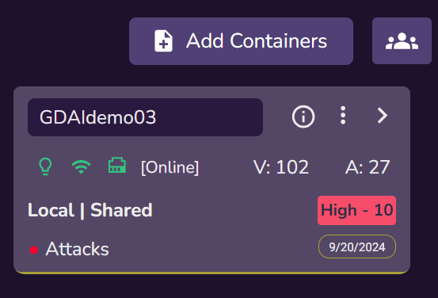

---

### Card and Table icons

The Card view and Table view buttons allow you to change how the information on the screen is shown. By default the information in the system is shown in card formats. Using this option allows to format the content in table format.

---

### Container Details Page
This page provides detailed information about the unit:
- **Friendly name**: The name assigned to the unit during registration.
- **Serial number**: The unique serial number of the unit.
- **ID**: The system-provided unique identifier.
- **Privacy Mode**: Shared or Not Shared.
- **Vulnerability Score**: Shows the highest score from vulnerabilities found.
- **Shared Mode**: True or False.
- **Status icons**: Indicating the status of services, wireless, and Ethernet.
- **Vulnerabilities and attacks**: Detected by the unit.
- **Latest Scan**: Shows when the last timestamp on scan and collected data.
- **IPs**: Showing Private and Public IPs.
- **Attacks card**: Showing information for attacks.
- **Vulnerabilities card**: Showing information about vulnerabilities.
- **Networks card**: Showing information about digital assets on the network.

There are multiple items on this page, let’s go through all of them:

1. Friendly name of the unit. This is the name you chose for the unit when registering it.
2. Serial number. This is the serial number that was used to register the unit.
3. ID. This is an identification name provided by the system. This cannot be modified.
4. Privacy mode.
   1. Shared.
   2. Not shared.
5. Vulnerability score.
6. Shared mode.
7. Status icons. From left to right:
   1. Services online (green) or offline (red)
   2. Wireless on, idle, standby
   3. Ethernet on, idle, standby
8. Vulnerability level and attacks. Highest level of severity of vulnerabilities found.
9. Last updated. Last time the data was received and refreshed from the unit.
10. IP addresses.
    1.  Private.
    2.  Public.
11. Container attacks card.
    1.  Arrow opens attacks page.
    2.  Total number of attacks.
    3.  The amount of time it took to contained all the attacks.
    4.  The amount of time that took to detect the attacks.
12. Container vulnerabilities card. Based on this container:
    1.  Arrow opens vulnerabilities page.
    2.  Local score. The severity level of all local containers.
    3.  Remote score. The severity vulnerability level of all remote containers.
    4.  Number of local vulnerabilities. Total number of vulnerabilities found by local containers.
    5.  Number of remote vulnerabilities. Total number of vulnerabilities found by remote containers.
13. Container networks card. Based on this specific containers:
    1.  Arrow opens networks page.
    2.  Local. These shown here are all network devices found by local containers.
    3.  Remote. These represent the total number of connected devices found by remote containers.
    4.  Local wireless. These are the wireless networks, and surrounding wireless devices transmitting, found by local containers.
    5.  Remote wireless. These are the wireless networks, and surrounding wireless devices transmitting, found by remote containers.

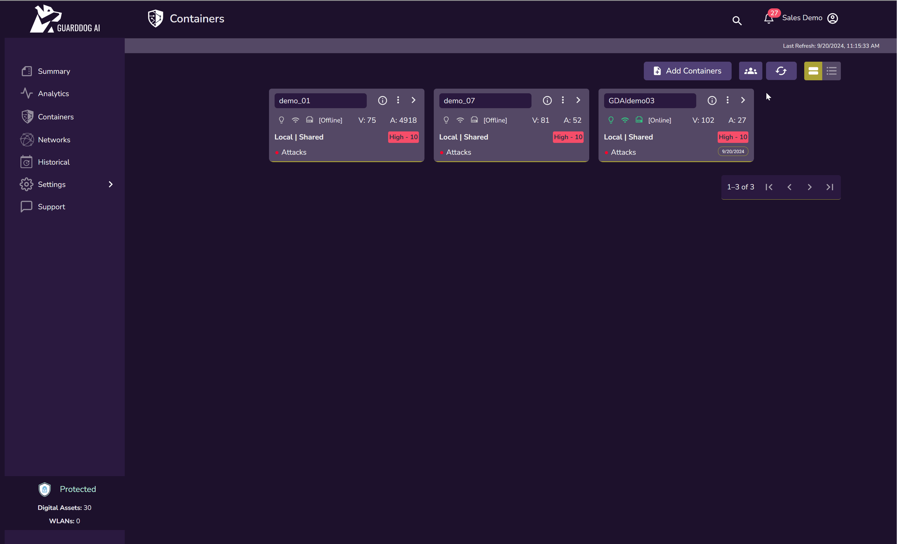

---

## Networks

### Networks Page
This page consolidates data from all units in the system. It includes:
1. Local Networks: Digital assets on the networks with containers marked as local.
2. Remote Networks: Digital assets on the networks with containers marked as remote.
3. Wireless Networks: Surrounding wireless networks detected.

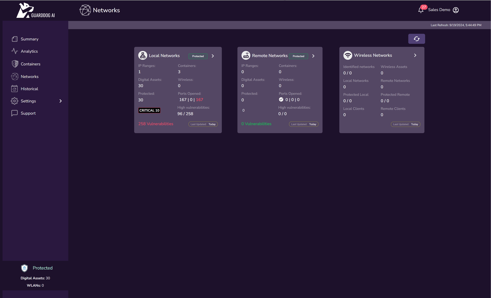

---

## Historical

### Global Historical Page
This page presents historical data on vulnerabilities and attacks detected in the system.

### Historical Vulnerabilities and Attacks Graph
This card shows a graphical representation of vulnerabilities and attacks over time.

### Timeframe Selector
Select the desired timeframe to view historical data.

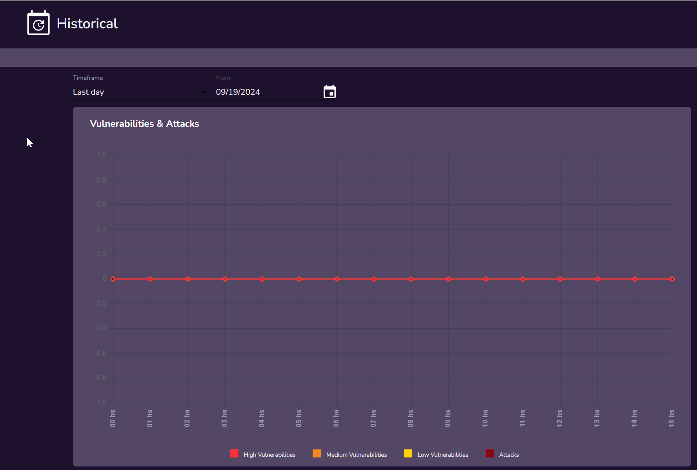

### Historical Attacks Card
This card displays historical data on attacks detected by the system.

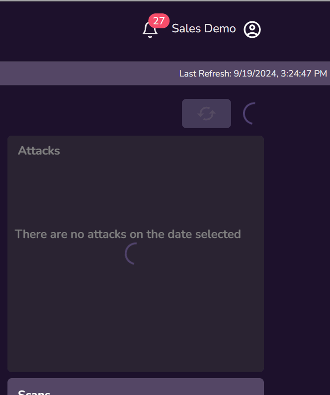

### Historical Scans Card
This card shows historical scan data.

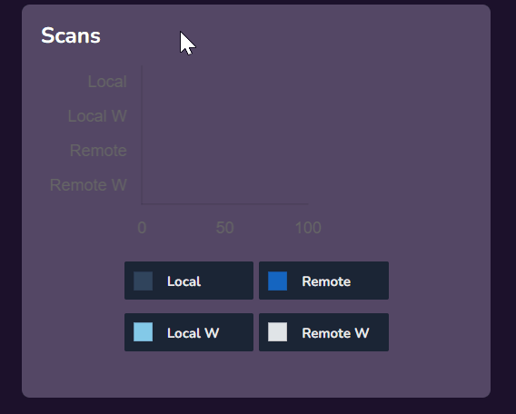

### Historical Networks Card
This card shows historical data on networks detected by all containers.

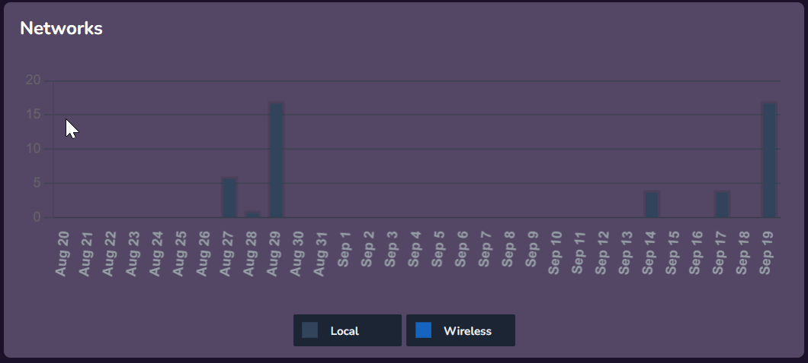

### Historical Wireless Card
This card shows historical data on networks detected by all containers.

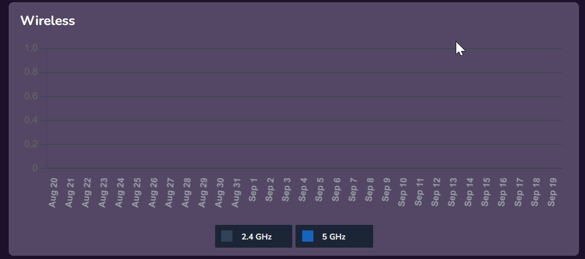

---

## Settings

### Preferences
In the **Settings > Preferences** section, you can configure the system to send email reports at specific intervals.

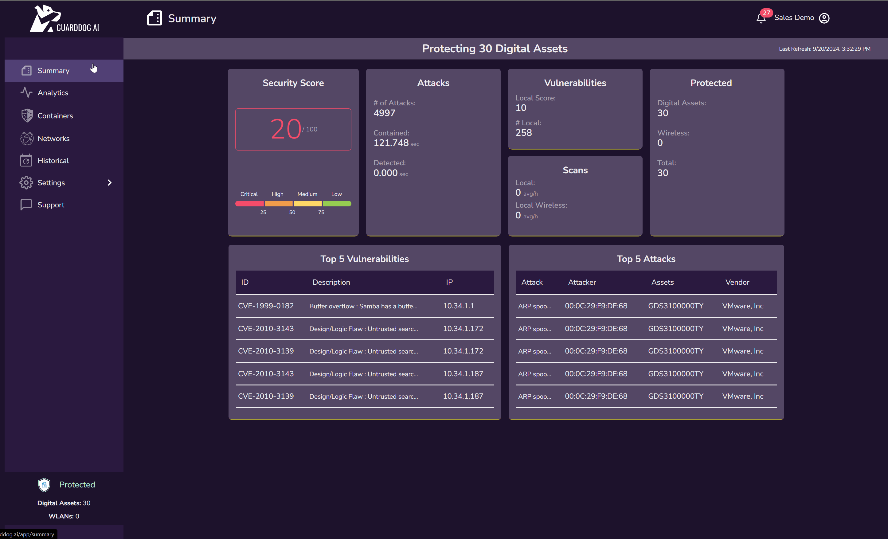

#### Modules
In the **Preferences > Modules** section, you can configure the time interval for data displayed in the portal. By default, data from the last week is shown, but other timeframes can be selected.

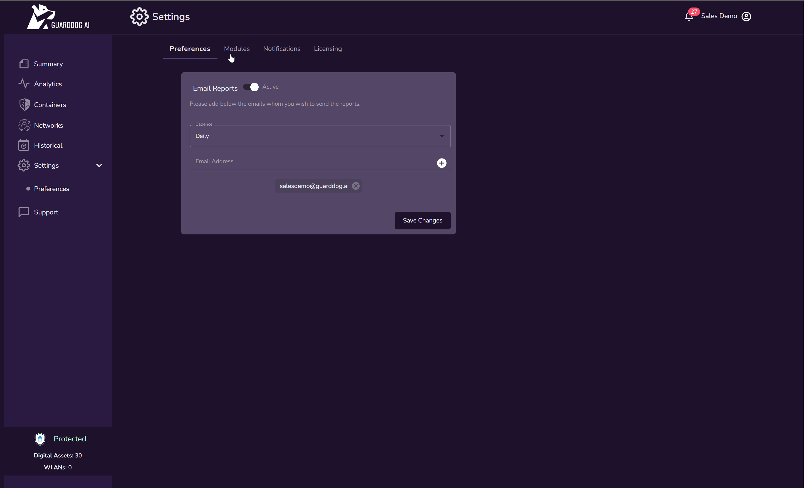

#### Notifications
In the **Preferences > Notifications** section, you can view notifications received by the system.

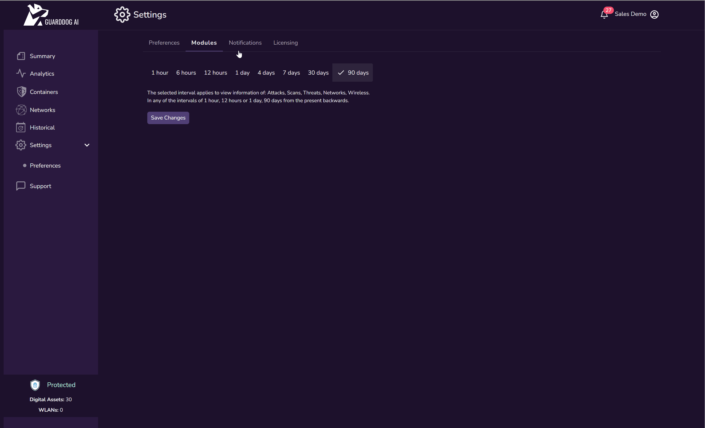

#### Licensing
In the **Preferences > Licensing** section, you can view all licenses you purchased and that are assigned to your account.

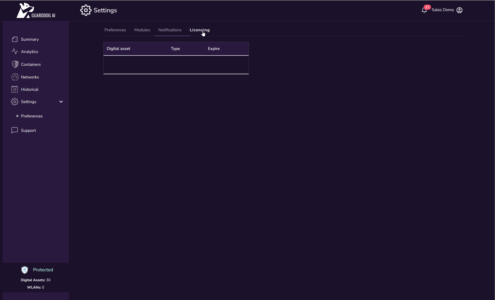

---

## Support

### Support Page
To contact support, go to the **Support** page and click on "Open a support ticket".

### Support Form
Fill out the form with detailed information about the incident and submit the ticket.

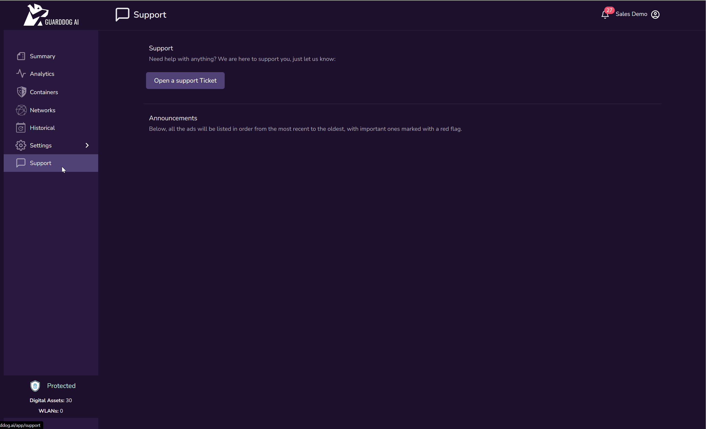

---

## How Do I...

### Create an account?
1. Go to [https://dcx.guarddog.ai](https://dcx.guarddog.ai) and click on **Sign Up**.

### Choose a secure password?
1. Follow the password guidelines provided during the account creation process. Use at least 20 characters for better security.

### Log in to the portal?
1. Go to [https://dcx.guarddog.ai](https://dcx.guarddog.ai) and enter your account credentials.

### Register my DCX Edge Sensor?
1. Go to **Containers > Add Containers** and enter the serial number and PIN. You can also scan the QR code on the unit’s label.

### Protect my local network devices?
1. By default, all discoverable devices on the local network are protected. You can manually protect or unprotect devices as needed.

### Protect a wireless network?
1. Go to **Networks > Wireless Networks > Identified Networks** and select the network you want to protect.

### Change the time interval for data display?
1. Go to **Settings > Preferences > Modules** and select the desired time interval.

---

## Steps

Follow these steps to launch attacks and detect them with a DCX Edge Sensor:

1. Obtain a license to deploy a DCX Edge Sensor container.
2. Register for an account at [https://dcx.guarddog.ai](https://dcx.guarddog.ai).
3. Login with your credentials.
4. Ensure the host where you deploy the containers has access to the local network and the internet.
5. Deploy the container and allow time for updates to complete.
6. Rregistration of the deployed container occurs automatically.
7. Once operational, the container will display three green status icons.
8. Ensure the container is functional by viewing network data.
9. If available, protect your wireless network by going to **Networks > Wireless Networks**.
10. We recommend filling out all the information in your profile to complete the task.

---